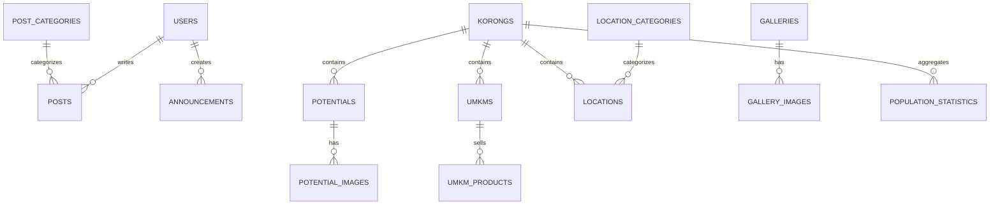

# Spesifikasi Database Website Nagari Campago

> **Target stack:** Laravel + MariaDB  
> **Tujuan dokumen:** menjadi acuan awal pembuatan migration, model, relasi, seeder, dan form admin untuk Website Nagari Campago.  
> **Catatan:** skema ini sengaja dibuat modular. Tidak semua tabel harus langsung dibuat di awal. Prioritaskan bagian **MVP** terlebih dahulu agar website selesai dan bisa dipakai perangkat nagari.

---

## 1. Prinsip Struktur Database

### Konvensi
- Nama tabel: `snake_case`, bentuk jamak bila mengikuti konvensi Laravel.
- Primary key: `id` tipe `BIGINT UNSIGNED AUTO_INCREMENT`.
- Foreign key: `{nama_model}_id`.
- Semua tabel konten utama memakai:
  - `created_at`
  - `updated_at`
- Konten yang berpotensi dihapus tetapi masih perlu dipulihkan dapat memakai:
  - `deleted_at` (`softDeletes`)
- Teks URL menggunakan `slug` yang unik.
- Gambar/file **tidak disimpan sebagai BLOB** di database. Simpan hanya path/URL file.
- Konten publik sebaiknya memiliki status:
  - `draft`
  - `published`
  - `archived`

### Prioritas Implementasi
**MVP / wajib:**
1. Users/Admin
2. Profil Nagari
3. Korong
4. Perangkat Nagari
5. Berita
6. Pengumuman
7. Layanan Administrasi
8. Potensi Nagari
9. UMKM
10. Lokasi/Pemetaan
11. Galeri
12. Kontak & pengaturan website

**Tahap lanjutan / opsional:**
- Agenda
- Dokumen publik
- Statistik penduduk
- Pengaduan/aspirasi
- Banner/slider
- Log aktivitas admin

---

# 2. Tabel Inti

## 2.1 `users`
Menyimpan akun yang dapat masuk ke dashboard admin.

| Field | Type | Constraint | Keterangan |
|---|---|---|---|
| id | BIGINT UNSIGNED | PK | ID user |
| name | VARCHAR(100) | NOT NULL | Nama admin/perangkat |
| email | VARCHAR(150) | UNIQUE, NOT NULL | Email login |
| password | VARCHAR(255) | NOT NULL | Password terenkripsi |
| role | ENUM | NOT NULL | `super_admin`, `admin`, `editor` |
| is_active | BOOLEAN | DEFAULT 1 | Status akun |
| last_login_at | DATETIME | NULL | Login terakhir |
| remember_token | VARCHAR(100) | NULL | Laravel auth |
| created_at | TIMESTAMP | | |
| updated_at | TIMESTAMP | | |

### Catatan
- Untuk versi sederhana, `role` cukup berupa ENUM.
- Bila hak akses makin kompleks, gunakan package seperti Spatie Laravel Permission dan pisahkan menjadi tabel roles/permissions.

---

## 2.2 `village_profiles`
Menyimpan profil utama nagari.

Idealnya hanya ada **1 record aktif**.

| Field | Type | Constraint | Keterangan |
|---|---|---|---|
| id | BIGINT UNSIGNED | PK | |
| name | VARCHAR(150) | NOT NULL | Nama nagari |
| district | VARCHAR(150) | NOT NULL | Kecamatan |
| regency | VARCHAR(150) | NOT NULL | Kabupaten |
| province | VARCHAR(150) | NOT NULL | Provinsi |
| postal_code | VARCHAR(10) | NULL | Kode pos |
| address | TEXT | NULL | Alamat kantor |
| description | LONGTEXT | NULL | Deskripsi umum |
| history | LONGTEXT | NULL | Sejarah nagari |
| vision | TEXT | NULL | Visi |
| mission | LONGTEXT | NULL | Misi |
| area_km2 | DECIMAL(10,2) | NULL | Luas wilayah |
| population | INT UNSIGNED | NULL | Jumlah penduduk |
| population_year | YEAR | NULL | Tahun data penduduk |
| latitude | DECIMAL(10,7) | NULL | Koordinat kantor nagari |
| longitude | DECIMAL(10,7) | NULL | Koordinat kantor nagari |
| phone | VARCHAR(30) | NULL | Telepon |
| email | VARCHAR(150) | NULL | Email resmi |
| logo_path | VARCHAR(255) | NULL | Logo |
| hero_image_path | VARCHAR(255) | NULL | Foto utama |
| created_at | TIMESTAMP | | |
| updated_at | TIMESTAMP | | |

### Seed awal yang diketahui
- `name`: Nagari Campago
- `district`: V Koto Kampung Dalam
- `regency`: Padang Pariaman
- `province`: Sumatera Barat
- `area_km2`: sekitar 9.86

> **Jangan langsung menganggap data penduduk 12.750 jiwa sebagai data terkini.** Angka tersebut berasal dari data tahun 2018 dan perlu diverifikasi ke perangkat nagari sebelum dipublikasikan.

---

## 2.3 `korongs`
Daftar wilayah/korong di Nagari Campago.

| Field | Type | Constraint | Keterangan |
|---|---|---|---|
| id | BIGINT UNSIGNED | PK | |
| name | VARCHAR(150) | UNIQUE, NOT NULL | Nama korong |
| slug | VARCHAR(170) | UNIQUE, NOT NULL | URL |
| description | TEXT | NULL | Profil singkat |
| head_name | VARCHAR(150) | NULL | Nama kepala korong |
| population | INT UNSIGNED | NULL | Jumlah penduduk |
| area_km2 | DECIMAL(10,2) | NULL | Luas |
| latitude | DECIMAL(10,7) | NULL | Titik pusat |
| longitude | DECIMAL(10,7) | NULL | Titik pusat |
| image_path | VARCHAR(255) | NULL | Foto |
| sort_order | SMALLINT UNSIGNED | DEFAULT 0 | Urutan |
| is_active | BOOLEAN | DEFAULT 1 | Status |
| created_at | TIMESTAMP | | |
| updated_at | TIMESTAMP | | |

### Seed awal korong
1. Bukik Gonggang
2. Kampung Dalam
3. Kampung Tanjuang
4. Padang Manih
5. Kampung Pauh
6. Bukik Caliak Rawang
7. Bukik Caliak
8. Ajuang

---

## 2.4 `officials`
Menyimpan perangkat/pemerintahan nagari.

| Field | Type | Constraint | Keterangan |
|---|---|---|---|
| id | BIGINT UNSIGNED | PK | |
| name | VARCHAR(150) | NOT NULL | Nama |
| position | VARCHAR(150) | NOT NULL | Jabatan |
| nip | VARCHAR(50) | NULL | NIP/NIK bila memang boleh dipublikasikan |
| photo_path | VARCHAR(255) | NULL | Foto |
| bio | TEXT | NULL | Profil singkat |
| phone | VARCHAR(30) | NULL | Opsional |
| email | VARCHAR(150) | NULL | Opsional |
| start_period | DATE | NULL | Awal masa jabatan |
| end_period | DATE | NULL | Akhir masa jabatan |
| sort_order | SMALLINT UNSIGNED | DEFAULT 0 | Urutan tampilan |
| is_active | BOOLEAN | DEFAULT 1 | Aktif/tidak |
| created_at | TIMESTAMP | | |
| updated_at | TIMESTAMP | | |

### Catatan privasi
Jangan menyimpan atau menampilkan NIK, nomor pribadi, atau data sensitif kecuali memang dibutuhkan dan mendapat persetujuan.

---

# 3. Berita, Informasi, dan Publikasi

## 3.1 `post_categories`
Kategori berita/artikel.

| Field | Type | Constraint |
|---|---|---|
| id | BIGINT UNSIGNED | PK |
| name | VARCHAR(100) | UNIQUE |
| slug | VARCHAR(120) | UNIQUE |
| description | TEXT | NULL |
| created_at | TIMESTAMP | |
| updated_at | TIMESTAMP | |

Contoh:
- Berita Nagari
- Kegiatan
- Pemerintahan
- Pertanian
- UMKM
- Kesehatan
- Kebudayaan

---

## 3.2 `posts`
Berita dan artikel website.

| Field | Type | Constraint | Keterangan |
|---|---|---|---|
| id | BIGINT UNSIGNED | PK | |
| category_id | BIGINT UNSIGNED | FK, NULL | Kategori |
| author_id | BIGINT UNSIGNED | FK users | Penulis |
| title | VARCHAR(255) | NOT NULL | Judul |
| slug | VARCHAR(280) | UNIQUE | URL |
| excerpt | TEXT | NULL | Ringkasan |
| content | LONGTEXT | NOT NULL | Isi artikel |
| featured_image_path | VARCHAR(255) | NULL | Thumbnail |
| status | ENUM | DEFAULT `draft` | draft/published/archived |
| published_at | DATETIME | NULL | Waktu publikasi |
| views | BIGINT UNSIGNED | DEFAULT 0 | Statistik sederhana |
| meta_title | VARCHAR(255) | NULL | SEO |
| meta_description | VARCHAR(300) | NULL | SEO |
| created_at | TIMESTAMP | | |
| updated_at | TIMESTAMP | | |
| deleted_at | TIMESTAMP | NULL | Soft delete |

### Relasi
- `post_categories 1 --- n posts`
- `users 1 --- n posts`

---

## 3.3 `announcements`
Pengumuman singkat.

| Field | Type | Constraint |
|---|---|---|
| id | BIGINT UNSIGNED | PK |
| title | VARCHAR(255) | NOT NULL |
| slug | VARCHAR(280) | UNIQUE |
| content | LONGTEXT | NOT NULL |
| file_path | VARCHAR(255) | NULL |
| start_date | DATE | NULL |
| end_date | DATE | NULL |
| is_pinned | BOOLEAN | DEFAULT 0 |
| status | ENUM | DEFAULT `draft` |
| published_at | DATETIME | NULL |
| created_by | BIGINT UNSIGNED | FK users |
| created_at | TIMESTAMP | |
| updated_at | TIMESTAMP | |

---

## 3.4 `agendas` — Opsional
Agenda kegiatan yang akan datang.

| Field | Type | Constraint |
|---|---|---|
| id | BIGINT UNSIGNED | PK |
| title | VARCHAR(255) | NOT NULL |
| description | TEXT | NULL |
| start_at | DATETIME | NOT NULL |
| end_at | DATETIME | NULL |
| location | VARCHAR(255) | NULL |
| organizer | VARCHAR(150) | NULL |
| contact_person | VARCHAR(150) | NULL |
| status | ENUM | `scheduled`, `completed`, `cancelled` |
| created_at | TIMESTAMP | |
| updated_at | TIMESTAMP | |

---

# 4. Layanan Administrasi Nagari

## 4.1 `services`
Daftar layanan yang tersedia di kantor nagari.

Contoh:
- Surat Keterangan Domisili
- Surat Keterangan Usaha
- Surat Keterangan Tidak Mampu
- Surat Pengantar
- Informasi administrasi lainnya

| Field | Type | Constraint |
|---|---|---|
| id | BIGINT UNSIGNED | PK |
| name | VARCHAR(200) | NOT NULL |
| slug | VARCHAR(220) | UNIQUE |
| description | TEXT | NULL |
| requirements | LONGTEXT | NULL |
| procedure | LONGTEXT | NULL |
| duration | VARCHAR(100) | NULL |
| cost | VARCHAR(100) | NULL |
| service_hours | VARCHAR(255) | NULL |
| contact | VARCHAR(100) | NULL |
| downloadable_form_path | VARCHAR(255) | NULL |
| is_online | BOOLEAN | DEFAULT 0 |
| external_url | VARCHAR(500) | NULL |
| sort_order | SMALLINT UNSIGNED | DEFAULT 0 |
| is_active | BOOLEAN | DEFAULT 1 |
| created_at | TIMESTAMP | |
| updated_at | TIMESTAMP | |

### Catatan
Lebih aman website hanya **memberikan informasi persyaratan dan prosedur** bila nagari belum memiliki sistem layanan online resmi. Jangan membuat alur pengajuan surat digital yang seolah-olah resmi tanpa persetujuan dan kesiapan perangkat nagari.

---

## 4.2 `public_documents`
Dokumen yang memang boleh diakses publik.

| Field | Type | Constraint |
|---|---|---|
| id | BIGINT UNSIGNED | PK |
| title | VARCHAR(255) | NOT NULL |
| category | VARCHAR(100) | NULL |
| description | TEXT | NULL |
| file_path | VARCHAR(255) | NOT NULL |
| document_date | DATE | NULL |
| year | YEAR | NULL |
| is_public | BOOLEAN | DEFAULT 1 |
| download_count | BIGINT UNSIGNED | DEFAULT 0 |
| uploaded_by | BIGINT UNSIGNED | FK users |
| created_at | TIMESTAMP | |
| updated_at | TIMESTAMP | |

Contoh kategori:
- Peraturan Nagari
- Formulir
- Laporan
- Transparansi
- Dokumen Perencanaan

---

# 5. Potensi Nagari

## 5.1 `potentials`
Semua potensi unggulan nagari.

| Field | Type | Constraint |
|---|---|---|
| id | BIGINT UNSIGNED | PK |
| korong_id | BIGINT UNSIGNED | FK, NULL |
| name | VARCHAR(200) | NOT NULL |
| slug | VARCHAR(220) | UNIQUE |
| category | ENUM | pertanian, wisata, budaya, kerajinan, kuliner, lainnya |
| short_description | TEXT | NULL |
| description | LONGTEXT | NULL |
| address | TEXT | NULL |
| latitude | DECIMAL(10,7) | NULL |
| longitude | DECIMAL(10,7) | NULL |
| contact_name | VARCHAR(150) | NULL |
| contact_phone | VARCHAR(30) | NULL |
| featured_image_path | VARCHAR(255) | NULL |
| status | ENUM | draft, published, archived |
| created_at | TIMESTAMP | |
| updated_at | TIMESTAMP | |
| deleted_at | TIMESTAMP | NULL |

### Contoh potensi awal
- Jagung
- Padi
- Kelapa
- Keripik jangek
- Kerajinan rajutan
- Potensi wisata yang sudah diverifikasi di lapangan
- Kebudayaan/tradisi lokal yang disetujui untuk dipublikasikan

> Jangan membuat data potensi wisata atau budaya hanya berdasarkan asumsi. Setiap entri sebaiknya memiliki sumber data atau hasil wawancara lapangan.

---

## 5.2 `potential_images`
Galeri khusus tiap potensi.

| Field | Type | Constraint |
|---|---|---|
| id | BIGINT UNSIGNED | PK |
| potential_id | BIGINT UNSIGNED | FK |
| image_path | VARCHAR(255) | NOT NULL |
| caption | VARCHAR(255) | NULL |
| sort_order | SMALLINT UNSIGNED | DEFAULT 0 |
| created_at | TIMESTAMP | |
| updated_at | TIMESTAMP | |

---

# 6. UMKM Nagari

## 6.1 `umkms`

| Field | Type | Constraint | Keterangan |
|---|---|---|---|
| id | BIGINT UNSIGNED | PK | |
| korong_id | BIGINT UNSIGNED | FK, NULL | Lokasi korong |
| name | VARCHAR(200) | NOT NULL | Nama usaha |
| slug | VARCHAR(220) | UNIQUE | URL |
| owner_name | VARCHAR(150) | NULL | Nama pemilik jika diizinkan |
| category | VARCHAR(100) | NULL | Kuliner, kerajinan, jasa, dll |
| description | LONGTEXT | NULL | Deskripsi |
| address | TEXT | NULL | Alamat |
| latitude | DECIMAL(10,7) | NULL | Koordinat |
| longitude | DECIMAL(10,7) | NULL | Koordinat |
| phone | VARCHAR(30) | NULL | Kontak usaha |
| whatsapp | VARCHAR(30) | NULL | WhatsApp |
| instagram | VARCHAR(255) | NULL | Akun Instagram |
| facebook | VARCHAR(255) | NULL | Facebook |
| tiktok | VARCHAR(255) | NULL | TikTok |
| marketplace_url | VARCHAR(500) | NULL | Marketplace |
| google_maps_url | VARCHAR(500) | NULL | Google Maps |
| nib_status | BOOLEAN | DEFAULT 0 | Memiliki NIB/tidak |
| halal_status | ENUM | NULL | `belum`, `proses`, `terbit` |
| qris_status | BOOLEAN | DEFAULT 0 | Memiliki QRIS/tidak |
| featured_image_path | VARCHAR(255) | NULL | Foto utama |
| status | ENUM | DEFAULT `draft` | draft/published/archived |
| is_verified | BOOLEAN | DEFAULT 0 | Data sudah dicek |
| created_at | TIMESTAMP | | |
| updated_at | TIMESTAMP | | |
| deleted_at | TIMESTAMP | NULL | |

### Penting
Field `nib_status`, `halal_status`, dan `qris_status` **jangan digunakan untuk mempublikasikan nomor dokumen sensitif**. Bila dokumen perlu disimpan untuk administrasi internal, sebaiknya dibuat sistem terpisah dengan akses terbatas.

---

## 6.2 `umkm_products`
Produk dari setiap UMKM.

| Field | Type | Constraint |
|---|---|---|
| id | BIGINT UNSIGNED | PK |
| umkm_id | BIGINT UNSIGNED | FK |
| name | VARCHAR(200) | NOT NULL |
| slug | VARCHAR(220) | UNIQUE |
| description | TEXT | NULL |
| price | DECIMAL(15,2) | NULL |
| unit | VARCHAR(50) | NULL |
| image_path | VARCHAR(255) | NULL |
| is_available | BOOLEAN | DEFAULT 1 |
| sort_order | SMALLINT UNSIGNED | DEFAULT 0 |
| created_at | TIMESTAMP | |
| updated_at | TIMESTAMP | |

---

# 7. Pemetaan Digital / GIS Sederhana

## 7.1 `location_categories`
Kategori lokasi.

| Field | Type |
|---|---|
| id | BIGINT UNSIGNED |
| name | VARCHAR(100) |
| slug | VARCHAR(120) |
| icon | VARCHAR(100), NULL |
| marker_icon_path | VARCHAR(255), NULL |
| sort_order | SMALLINT UNSIGNED |
| is_active | BOOLEAN |
| timestamps | | |

### Seed kategori yang disarankan
- Kantor Pemerintahan
- Pendidikan
- Kesehatan
- Tempat Ibadah
- UMKM
- Pasar
- Fasilitas Umum
- Wisata
- Kebudayaan
- Pertanian

---

## 7.2 `locations`
Titik lokasi yang tampil di peta website.

| Field | Type | Constraint |
|---|---|---|
| id | BIGINT UNSIGNED | PK |
| location_category_id | BIGINT UNSIGNED | FK |
| korong_id | BIGINT UNSIGNED | FK, NULL |
| name | VARCHAR(200) | NOT NULL |
| slug | VARCHAR(220) | UNIQUE |
| description | TEXT | NULL |
| address | TEXT | NULL |
| latitude | DECIMAL(10,7) | NOT NULL |
| longitude | DECIMAL(10,7) | NOT NULL |
| phone | VARCHAR(30) | NULL |
| opening_hours | VARCHAR(255) | NULL |
| google_maps_url | VARCHAR(500) | NULL |
| image_path | VARCHAR(255) | NULL |
| source | VARCHAR(150) | NULL |
| last_verified_at | DATETIME | NULL |
| is_verified | BOOLEAN | DEFAULT 0 |
| status | ENUM | DEFAULT `draft` |
| created_at | TIMESTAMP | |
| updated_at | TIMESTAMP | |
| deleted_at | TIMESTAMP | NULL |

### Alasan `last_verified_at` penting
Lokasi usaha, nomor telepon, jam buka, dan fasilitas bisa berubah. Website sebaiknya bisa membedakan data yang baru diverifikasi dan data lama.

---

# 8. Galeri dan Media

## 8.1 `galleries`
Album kegiatan.

| Field | Type |
|---|---|
| id | BIGINT UNSIGNED |
| title | VARCHAR(200) |
| slug | VARCHAR(220) |
| description | TEXT, NULL |
| event_date | DATE, NULL |
| cover_image_path | VARCHAR(255), NULL |
| status | ENUM |
| created_at | TIMESTAMP |
| updated_at | TIMESTAMP |

---

## 8.2 `gallery_images`

| Field | Type |
|---|---|
| id | BIGINT UNSIGNED |
| gallery_id | BIGINT UNSIGNED FK |
| image_path | VARCHAR(255) |
| caption | VARCHAR(255), NULL |
| sort_order | SMALLINT UNSIGNED |
| created_at | TIMESTAMP |
| updated_at | TIMESTAMP |

---

# 9. Banner / Slider Homepage

## 9.1 `banners` — Opsional

| Field | Type |
|---|---|
| id | BIGINT UNSIGNED |
| title | VARCHAR(200), NULL |
| subtitle | TEXT, NULL |
| image_path | VARCHAR(255) |
| button_text | VARCHAR(100), NULL |
| button_url | VARCHAR(500), NULL |
| sort_order | SMALLINT UNSIGNED |
| is_active | BOOLEAN |
| start_at | DATETIME, NULL |
| end_at | DATETIME, NULL |
| created_at | TIMESTAMP |
| updated_at | TIMESTAMP |

---

# 10. Kontak dan Pengaturan Website

## 10.1 `settings`
Pengaturan global key-value.

| Field | Type |
|---|---|
| id | BIGINT UNSIGNED |
| key | VARCHAR(150) UNIQUE |
| value | LONGTEXT, NULL |
| type | VARCHAR(50) DEFAULT `text` |
| group_name | VARCHAR(100), NULL |
| is_public | BOOLEAN DEFAULT 0 |
| created_at | TIMESTAMP |
| updated_at | TIMESTAMP |

### Contoh key
- `site_name`
- `site_tagline`
- `site_logo`
- `footer_description`
- `office_address`
- `office_phone`
- `office_email`
- `facebook_url`
- `instagram_url`
- `youtube_url`
- `whatsapp_number`
- `google_maps_embed`
- `office_hours`

---

## 10.2 `contact_messages` — Opsional
Untuk form "Hubungi Kami".

| Field | Type |
|---|---|
| id | BIGINT UNSIGNED |
| name | VARCHAR(150) |
| email | VARCHAR(150), NULL |
| phone | VARCHAR(30), NULL |
| subject | VARCHAR(255) |
| message | LONGTEXT |
| status | ENUM(`new`,`read`,`replied`,`closed`) |
| read_at | DATETIME, NULL |
| created_at | TIMESTAMP |
| updated_at | TIMESTAMP |

### Keamanan
- Gunakan CAPTCHA/rate limit.
- Jangan tampilkan pesan secara publik.
- Validasi semua input.

---

# 11. Statistik Penduduk — Opsional dan Perlu Verifikasi

Untuk tahap awal, **jangan membuat database per individu penduduk** karena:
- bukan kebutuhan utama website publik;
- menambah risiko privasi;
- membutuhkan pengamanan dan otorisasi lebih kompleks.

Lebih aman menyimpan **data agregat**.

## 11.1 `population_statistics`

| Field | Type |
|---|---|
| id | BIGINT UNSIGNED |
| year | YEAR |
| korong_id | BIGINT UNSIGNED, NULL |
| total_population | INT UNSIGNED, NULL |
| male | INT UNSIGNED, NULL |
| female | INT UNSIGNED, NULL |
| households | INT UNSIGNED, NULL |
| children | INT UNSIGNED, NULL |
| productive_age | INT UNSIGNED, NULL |
| elderly | INT UNSIGNED, NULL |
| source | VARCHAR(255), NULL |
| verified_at | DATETIME, NULL |
| created_at | TIMESTAMP |
| updated_at | TIMESTAMP |

---

# 12. Pengaduan / Aspirasi — Jangan Dipaksakan ke MVP

Fitur ini hanya dibuat bila perangkat nagari memang siap menindaklanjuti.

## 12.1 `complaints`

| Field | Type |
|---|---|
| id | BIGINT UNSIGNED |
| ticket_code | VARCHAR(30) UNIQUE |
| name | VARCHAR(150) |
| phone | VARCHAR(30), NULL |
| email | VARCHAR(150), NULL |
| category | VARCHAR(100), NULL |
| subject | VARCHAR(255) |
| description | LONGTEXT |
| attachment_path | VARCHAR(255), NULL |
| status | ENUM(`submitted`,`verified`,`processed`,`completed`,`rejected`) |
| response | LONGTEXT, NULL |
| handled_by | BIGINT UNSIGNED, NULL |
| completed_at | DATETIME, NULL |
| created_at | TIMESTAMP |
| updated_at | TIMESTAMP |

### Risiko
Jangan menambahkan fitur ini hanya karena terlihat bagus. Tanpa SOP dan PIC dari nagari, fitur pengaduan justru bisa menumpuk laporan tanpa tindak lanjut dan menurunkan kepercayaan masyarakat.

---

# 13. Log Aktivitas Admin — Disarankan

## 13.1 `activity_logs`

| Field | Type |
|---|---|
| id | BIGINT UNSIGNED |
| user_id | BIGINT UNSIGNED, NULL |
| action | VARCHAR(100) |
| model_type | VARCHAR(150), NULL |
| model_id | BIGINT UNSIGNED, NULL |
| description | TEXT, NULL |
| ip_address | VARCHAR(45), NULL |
| user_agent | TEXT, NULL |
| created_at | TIMESTAMP |

Contoh:
- Admin membuat berita.
- Admin mengubah profil UMKM.
- Admin menghapus lokasi.
- Admin mempublikasikan pengumuman.

---

# 14. Relasi Utama

```text
users
 ├── hasMany posts
 ├── hasMany announcements
 └── hasMany public_documents

korongs
 ├── hasMany potentials
 ├── hasMany umkms
 ├── hasMany locations
 └── hasMany population_statistics

post_categories
 └── hasMany posts

potentials
 └── hasMany potential_images

umkms
 └── hasMany umkm_products

location_categories
 └── hasMany locations

galleries
 └── hasMany gallery_images
```

---

# 15. Diagram ERD Sederhana



---

# 16. Struktur Menu Website dan Sumber Datanya

| Menu Website | Tabel Utama |
|---|---|
| Beranda | `settings`, `banners`, `posts`, `potentials`, `umkms` |
| Profil Nagari | `village_profiles` |
| Wilayah/Korong | `korongs` |
| Pemerintahan | `officials` |
| Berita | `posts`, `post_categories` |
| Pengumuman | `announcements` |
| Layanan | `services`, `public_documents` |
| Potensi Nagari | `potentials`, `potential_images` |
| UMKM | `umkms`, `umkm_products` |
| Peta Nagari | `locations`, `location_categories` |
| Galeri | `galleries`, `gallery_images` |
| Kontak | `settings`, `contact_messages` |

---

# 17. Urutan Migration yang Disarankan

Agar foreign key tidak error:

```text
01_create_users_table
02_create_village_profiles_table
03_create_korongs_table
04_create_officials_table

05_create_post_categories_table
06_create_posts_table
07_create_announcements_table
08_create_agendas_table

09_create_services_table
10_create_public_documents_table

11_create_potentials_table
12_create_potential_images_table

13_create_umkms_table
14_create_umkm_products_table

15_create_location_categories_table
16_create_locations_table

17_create_galleries_table
18_create_gallery_images_table
19_create_banners_table

20_create_settings_table
21_create_contact_messages_table
22_create_population_statistics_table
23_create_complaints_table
24_create_activity_logs_table
```

---

# 18. Index yang Perlu Dibuat

Selain primary key dan foreign key:

```text
posts.slug                       UNIQUE
posts.status                     INDEX
posts.published_at               INDEX

announcements.slug               UNIQUE
announcements.status             INDEX

korongs.slug                     UNIQUE

potentials.slug                  UNIQUE
potentials.category              INDEX
potentials.status                INDEX

umkms.slug                       UNIQUE
umkms.category                   INDEX
umkms.status                     INDEX
umkms.is_verified                INDEX

locations.slug                   UNIQUE
locations.latitude               INDEX (opsional)
locations.longitude              INDEX (opsional)
locations.status                 INDEX
locations.is_verified            INDEX

services.slug                    UNIQUE
galleries.slug                   UNIQUE
settings.key                     UNIQUE
```

Untuk pencarian teks yang lebih kompleks bisa ditambahkan `FULLTEXT` pada:
- `posts.title`, `posts.content`
- `potentials.name`, `potentials.description`
- `umkms.name`, `umkms.description`

---

# 19. Data yang Harus Dikumpulkan dari Nagari

Sebelum mengisi database produksi, verifikasi minimal:

## Profil
- Nama resmi nagari
- Alamat kantor
- Nomor telepon/email
- Visi dan misi
- Sejarah
- Luas wilayah
- Jumlah penduduk terbaru + tahun sumber
- Logo/foto resmi

## Pemerintahan
- Nama wali nagari
- Struktur perangkat
- Jabatan
- Foto yang diizinkan
- Masa jabatan bila akan ditampilkan

## Korong
- Nama resmi 8 korong
- Kepala korong
- Data singkat
- Titik koordinat bila dibutuhkan

## Layanan
- Jenis surat/layanan
- Persyaratan
- Alur
- Biaya resmi
- Lama proses
- Jam layanan
- Formulir publik

## Potensi
- Pertanian unggulan
- Wisata
- Budaya
- Kerajinan
- Kuliner
- Narahubung
- Foto
- Lokasi

## UMKM
- Nama usaha
- Kategori
- Pemilik (dengan izin)
- Produk
- Alamat
- Kontak bisnis
- Google Maps
- Media sosial
- Foto
- Status verifikasi

## Lokasi Peta
- Nama lokasi
- Kategori
- Alamat
- Latitude
- Longitude
- Foto
- Sumber data
- Tanggal verifikasi

---

# 20. Rekomendasi MVP untuk KKN

Karena waktu KKN terbatas, **jangan langsung membangun semua fitur**.

### Fase 1 — Fondasi
- `users`
- `village_profiles`
- `korongs`
- `officials`
- `settings`

### Fase 2 — Konten utama
- `post_categories`
- `posts`
- `announcements`
- `services`

### Fase 3 — Potensi dan promosi
- `potentials`
- `umkms`
- `umkm_products`

### Fase 4 — Pemetaan digital
- `location_categories`
- `locations`

### Fase 5 — Pelengkap
- `galleries`
- `gallery_images`
- `public_documents`

### Tunda dulu kecuali diminta nagari
- Sistem pengaduan
- Data penduduk per individu
- Sistem surat online penuh
- Dashboard statistik terlalu kompleks
- Multi-role permission yang sangat detail

---

# 21. Rekomendasi Struktur Model Laravel

```text
app/Models/
├── User.php
├── VillageProfile.php
├── Korong.php
├── Official.php
├── PostCategory.php
├── Post.php
├── Announcement.php
├── Agenda.php
├── Service.php
├── PublicDocument.php
├── Potential.php
├── PotentialImage.php
├── Umkm.php
├── UmkmProduct.php
├── LocationCategory.php
├── Location.php
├── Gallery.php
├── GalleryImage.php
├── Banner.php
├── Setting.php
├── ContactMessage.php
├── PopulationStatistic.php
├── Complaint.php
└── ActivityLog.php
```

---

# 22. Contoh Relasi Laravel

## `Korong.php`

```php
public function potentials()
{
    return $this->hasMany(Potential::class);
}

public function umkms()
{
    return $this->hasMany(Umkm::class);
}

public function locations()
{
    return $this->hasMany(Location::class);
}
```

## `Umkm.php`

```php
public function korong()
{
    return $this->belongsTo(Korong::class);
}

public function products()
{
    return $this->hasMany(UmkmProduct::class);
}
```

## `Post.php`

```php
public function category()
{
    return $this->belongsTo(PostCategory::class);
}

public function author()
{
    return $this->belongsTo(User::class, 'author_id');
}
```

---

# 23. Aturan Validasi Penting

### `posts`
- `title`: required, max 255
- `slug`: unique
- `content`: required
- `status`: enum valid
- `featured_image`: image, ukuran dibatasi

### `umkms`
- `name`: required
- `latitude`: numeric, between -90 and 90
- `longitude`: numeric, between -180 and 180
- nomor WhatsApp/telepon harus divalidasi
- URL media sosial harus valid
- publikasi hanya setelah `is_verified = true`

### `locations`
- nama, kategori, latitude, longitude wajib
- koordinat tidak boleh asal/placeholder
- `last_verified_at` diisi saat survei atau verifikasi

---

# 24. Keamanan dan Privasi

1. Password wajib memakai hashing Laravel.
2. Dashboard admin wajib memakai authentication.
3. Batasi upload berdasarkan tipe dan ukuran file.
4. Jangan menyimpan file upload langsung di folder publik tanpa validasi.
5. Gunakan CSRF protection Laravel.
6. Form publik gunakan rate limiting.
7. Jangan publikasikan:
   - NIK warga
   - nomor KK
   - data kesehatan individu
   - dokumen legal pribadi
   - nomor dokumen usaha sensitif
8. Backup database secara berkala.
9. Pisahkan `.env` dari repository Git.
10. Buat akun admin individual, jangan satu akun/password dipakai ramai-ramai bila memungkinkan.

---

# 25. Backup dan Serah Terima Setelah KKN

Agar website tidak berhenti setelah mahasiswa KKN pulang:

- Minimal 1–2 perangkat nagari memiliki akun admin.
- Siapkan panduan:
  - tambah berita;
  - ubah profil;
  - tambah UMKM;
  - tambah titik lokasi;
  - upload foto;
  - backup database.
- Buat database dump `.sql` pada saat serah terima.
- Simpan source code di repository resmi.
- Dokumentasikan:
  - versi PHP;
  - Laravel;
  - MariaDB;
  - konfigurasi hosting;
  - akun domain/hosting yang dikelola pihak nagari.
- Jangan menyerahkan website yang hanya bisa dipelihara oleh mahasiswa pembuatnya.

---

# 26. Ringkasan Tabel MVP

| No | Tabel | Fungsi | Prioritas |
|---|---|---|---|
| 1 | `users` | Login admin | Wajib |
| 2 | `village_profiles` | Profil nagari | Wajib |
| 3 | `korongs` | Data 8 korong | Wajib |
| 4 | `officials` | Perangkat nagari | Wajib |
| 5 | `post_categories` | Kategori berita | Wajib |
| 6 | `posts` | Berita/artikel | Wajib |
| 7 | `announcements` | Pengumuman | Wajib |
| 8 | `services` | Informasi layanan | Wajib |
| 9 | `potentials` | Potensi nagari | Wajib |
| 10 | `umkms` | Direktori UMKM | Wajib |
| 11 | `umkm_products` | Produk UMKM | Disarankan |
| 12 | `location_categories` | Kategori peta | Wajib |
| 13 | `locations` | Titik lokasi GIS | Wajib |
| 14 | `galleries` | Album kegiatan | Disarankan |
| 15 | `gallery_images` | Foto album | Disarankan |
| 16 | `settings` | Konfigurasi website | Wajib |
| 17 | `public_documents` | Dokumen publik | Opsional |
| 18 | `agendas` | Agenda | Opsional |
| 19 | `banners` | Slider homepage | Opsional |
| 20 | `population_statistics` | Statistik agregat | Opsional |
| 21 | `contact_messages` | Pesan kontak | Opsional |
| 22 | `complaints` | Aspirasi/pengaduan | Tunda kecuali siap |
| 23 | `activity_logs` | Audit admin | Disarankan |

---

# 27. Kesimpulan Arsitektur

Untuk Website Nagari Campago, inti database sebaiknya fokus pada tiga kebutuhan nyata:

1. **Informasi publik**
   - profil
   - perangkat
   - berita
   - pengumuman
   - layanan

2. **Promosi potensi nagari**
   - pertanian
   - budaya
   - wisata
   - UMKM dan produk

3. **Pemetaan digital**
   - fasilitas umum
   - pendidikan
   - kesehatan
   - tempat ibadah
   - UMKM
   - lokasi penting lainnya

Dengan pendekatan ini, database tetap cukup lengkap tetapi masih realistis dikerjakan selama KKN dan lebih mudah diteruskan oleh perangkat nagari setelah program selesai.
